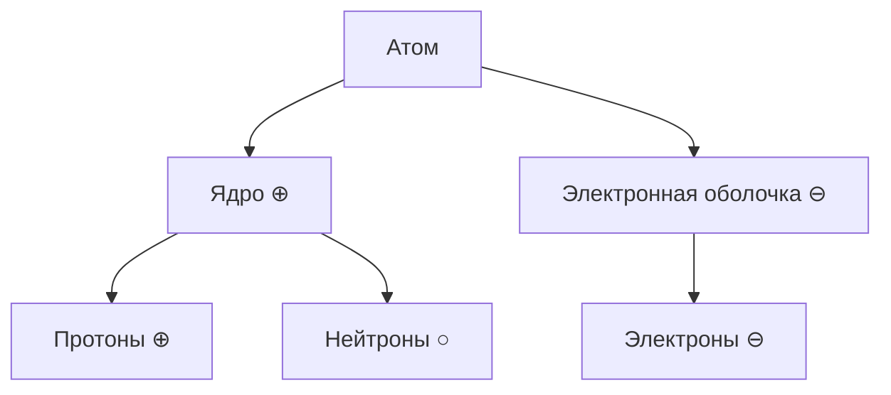

#ilian445 #physics #class-8 
## Билет 1
### 1.
==Электризация== - это явление возникновения электрических свойств у тела. Вещество является наэлектризованным, когда оно при трении приобретало свойство притягивать легкие тела. При трении электризуются оба тела.
==Электрический заряд== - это мера свойств заряженных тел, определённым образом взаимодействующих друг с другом.

Роды электрических зарядов: положительный и отрицательный.

Действия одного заряженного тела на другое осуществляется посредством электрических полей, окружающих эти тела.
### 2.
Если к полюсам источника тока присоединить металлическую проволоку, то при замыкании цепи она нагреется и увеличившись, слегка провиснет.

$$\begin{gathered}
Q - количество\ теплоты\\
Q=A=UIt
Q=I^{2}Rt
\end{gathered}$$
Количество теплоты, выдлеляемое проводником с током, равно произведению квадрата силы тока, сопротивлени. проводника и времени.
## Билет 2
### 1.
==Электроскоп== - это приборы, служащие для электризации тел.

==Электрическое поле== - это особая форма материи, неразрывно связанная со всякими электрическими зарядами.

Человеческое тело и металл - проводники.
Стекло, резина, эбонит, фарфор - диэлектрики.
Полупроводники - это вещества, которые не проводят электрический ток при низкой температуре, однако при её повышении становятся проводниками.
### 2.
$$\begin{gathered}
P - мощность\\
P=\frac{A}{t}=uI
\end{gathered}$$
<mark style="background: #BBFABBA6;">Мощность электрического тока</mark> равна произведению напряжения и силы тока.

$$\begin{gathered}
A=IRq\ \ \ \ Дж=А*Ом*Кл\\
A=UIt\ \ \ \ Дж=В*А*с\\
A -работа\ [A]=1Дж\\
I-сила\ тока\ [I]=1A\\
R-сопротивление\ [R]=1Ом\\
q-электрический\ заряд\ [q]=1Кл
\end{gathered}$$
==Работа электрического тока на участке цепи== равна силе тока, умноженной на электрический заряд и на сопротивление.
<mark style="background: #ABF7F7A6;">Работа электрического тока на участке цепи </mark>равна произведению напряжения на его концах, силы тока и времени, в течении котрого совершается работа.
## Билет 3 β
==Электрон== - наименьшая частица вещества, обладающая элементарным отрицательным зарядом.

|                         | Последовательное соединение                                                                                                | Парралельное соединение                                                                                                                                                               |
| ----------------------- | ----------------------------------------------------------------------------------------------------------------------------- | ---------------------------------------------------------------------------------------------------------------------------------------------------------------------------------------- |
| **Схема**               | ![[14.png\|200]]                                                                                                              | ![[15.png\|200]]                                                                                                                                                                         |
| **Пояснение**           | Если исключить из схемы одну лампу, то цепь разомкнется и вторая гореть не будет                                              | Если исключить одну лампу, то другая продолжит свою работу                                                                                                                               |
| **Сила тока($I$)**      | $I=I_{1}=I_{2}$ При последовательном соединении проводников сила тока в любом участки цепи будет одинакова                 | $I=I_{1}+I_{2}$ Сила тока в неразведённой части цепи будет равна сумме сил токов в отдельных, парралельное соеденённых проводниках                                                    |
| **Сопротивление ($R$)** | $R=R_{1}+R{2}$ Общее сопротивление цепи при последовательном соединении равно сумме сопротивлений отдельных проводников    | $R=\frac{R_{1}}{n}$ - если на каждой ветке сопротивление одинаково (*n - количество веток*) $\frac{1}{R}=\frac{1}{R_{1}}=\frac{1}{R_{2}}$ - если на каждой ветке разное сопротивление |
| **Напряжение ($U$)**    | $u=u_{1}+u_{2}$ Полное напряжение в сети при последовательном соединении равно сумме напряжений на отдельных участках цепи | $u=u_{1}=u_{2}$ Напряжение на любом участке цепи и на концах всех паррелельное соеденённых проводников одно и то же                                                                   |
## Билет 4
**1911 г.** - Французкий учёный Эрнест Резерфор представил планетарную модель строения атома.

![[Физика/Элекричество/4.png|300]]

==Электризация== - это явление возникновения электрических свойств у тела. Вещество является наэлектризованным, когда оно при трении приобретало свойство притягивать легкие тела. При трении электризуются оба тела.
### 2.
