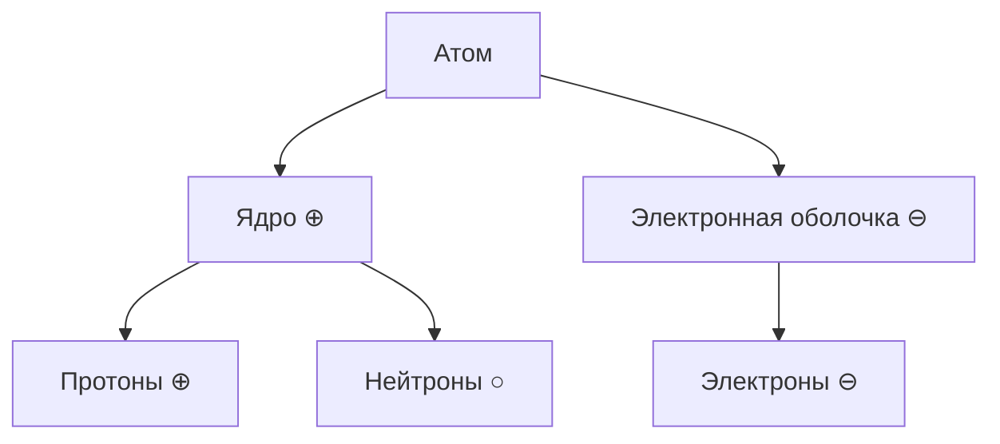

#ilian445 #physics #class-8 

>[!error] Внимание
>Данный файл не сождержит весь раздел Электричество, он содержит лишь выжимки из конспектов для подготовки. Если ранее вы не задумывались о данном предмете, то автор настоятельно рекомендует ознакомиться с конспектами по данному разделу по [[Физика|данной ссылке.]] Билеты, помеченые β будут дополнены в дальнейшем.

>[!note] Если у вас есть предложения по дополнению или актуализации, то просьба обратиться мне [в телеграм по ссылке.](https://t.me/m/6-LAQx_oMGYy)
## Билет 1
### 1.
==Электризация== - это явление возникновения электрических свойств у тела. Вещество является наэлектризованным, когда оно при трении приобретало свойство притягивать легкие тела. При трении электризуются оба тела.
==Электрический заряд== - это мера свойств заряженных тел, определённым образом взаимодействующих друг с другом.

Роды электрических зарядов: положительный и отрицательный.

Действия одного заряженного тела на другое осуществляется посредством электрических полей, окружающих эти тела.
### 2.
Если к полюсам источника тока присоединить металлическую проволоку, то при замыкании цепи она нагреется и увеличившись, слегка провиснет.

$$\begin{gathered}
Q - количество\ теплоты\\
Q=A=UIt
Q=I^{2}Rt
\end{gathered}$$
Количество теплоты, выдлеляемое проводником с током, равно произведению квадрата силы тока, сопротивлени. проводника и времени.
## Билет 2
### 1.
==Электроскоп== - это приборы, служащие для электризации тел.

==Электрическое поле== - это особая форма материи, неразрывно связанная со всякими электрическими зарядами.

Человеческое тело и металл - проводники.
Стекло, резина, эбонит, фарфор - диэлектрики.
Полупроводники - это вещества, которые не проводят электрический ток при низкой температуре, однако при её повышении становятся проводниками.
### 2.
$$\begin{gathered}
P - мощность\\
P=\frac{A}{t}=uI
\end{gathered}$$
<mark style="background: #BBFABBA6;">Мощность электрического тока</mark> равна произведению напряжения и силы тока.

$$\begin{gathered}
A=IRq\ \ \ \ Дж=А*Ом*Кл\\
A=UIt\ \ \ \ Дж=В*А*с\\
A -работа\ [A]=1Дж\\
I-сила\ тока\ [I]=1A\\
R-сопротивление\ [R]=1Ом\\
q-электрический\ заряд\ [q]=1Кл
\end{gathered}$$
==Работа электрического тока на участке цепи== равна силе тока, умноженной на электрический заряд и на сопротивление.
<mark style="background: #ABF7F7A6;">Работа электрического тока на участке цепи </mark>равна произведению напряжения на его концах, силы тока и времени, в течении котрого совершается работа.
## Билет 3 β
==Электрон== - наименьшая частица вещества, обладающая элементарным отрицательным зарядом.
Электрический заряд - одно из основных свойств электрона.

|                         | Последовательное соединение                                                                                                | Парралельное соединение                                                                                                                                                               |
| ----------------------- | ----------------------------------------------------------------------------------------------------------------------------- | ---------------------------------------------------------------------------------------------------------------------------------------------------------------------------------------- |
| **Схема**               | ![[14.png\|200]]                                                                                                              | ![[15.png\|200]]                                                                                                                                                                         |
| **Пояснение**           | Если исключить из схемы одну лампу, то цепь разомкнется и вторая гореть не будет                                              | Если исключить одну лампу, то другая продолжит свою работу                                                                                                                               |
| **Сила тока($I$)**      | $I=I_{1}=I_{2}$ При последовательном соединении проводников сила тока в любом участки цепи будет одинакова                 | $I=I_{1}+I_{2}$ Сила тока в неразведённой части цепи будет равна сумме сил токов в отдельных, парралельное соеденённых проводниках                                                    |
| **Сопротивление ($R$)** | $R=R_{1}+R{2}$ Общее сопротивление цепи при последовательном соединении равно сумме сопротивлений отдельных проводников    | $R=\frac{R_{1}}{n}$ - если на каждой ветке сопротивление одинаково (*n - количество веток*) $\frac{1}{R}=\frac{1}{R_{1}}=\frac{1}{R_{2}}$ - если на каждой ветке разное сопротивление |
| **Напряжение ($U$)**    | $u=u_{1}+u_{2}$ Полное напряжение в сети при последовательном соединении равно сумме напряжений на отдельных участках цепи | $u=u_{1}=u_{2}$ Напряжение на любом участке цепи и на концах всех паррелельное соеденённых проводников одно и то же                                                                   |
## Билет 4
**1911 г.** - Французкий учёный Эрнест Резерфор представил планетарную модель строения атома.

![[Физика/Элекричество/4.png|300]]

==Электризация== - это явление возникновения электрических свойств у тела. Вещество является наэлектризованным, когда оно при трении приобретало свойство притягивать легкие тела. При трении электризуются оба тела.
### 2.

$$\begin{gathered}
R = \frac{p*l}{S}\ \ \ \ \ [R]=1Ом \\
p -  удельное\ сопротивление\\
l - длинна\ проводника\ \ \ [l]=1м\\
S - полощадь\ поперечного\ сечения\ \ \ [S]=1мм^{2}\\
[p] = \frac{Ом*мм^{2}}{м}
\end{gathered}$$
Сопротивление проводника из данного вещества длинной $1м$, площадью поперечного сечения $1мм^{2}$ называется <mark style="background: #FF5582A6;">удельным сопротивлением</mark> этого вещества.

<mark style="background: #BBFABBA6;">Реостат</mark> - прибор для регулирования силы тока в цепи.
## Билет 5
### 1.
==Электрический ток== - это упорядоченное движение заряженных частиц под действием электрического поля.

Условия существования электрического тока:
1. Наличие свободных электронов
2. Наличие внешнего электрического поля для проводника
3. Замкнутая цепь

==Источник тока== - устройство, в котором любой вид энергии превращается в электрическую.

Источники тока:
- Гальванический элемент (батарейка, химическая **=>** электрическая)
- Термо-элемент (термопара, внутренняя **=>** электрическая)
- Фото-элемент (солнечная панель, световая **=>** электрическая)
- Электрофорная машина (электрофорная машина, механическая **=>** электрическая)
### 2.
$$\begin{gathered}
1Ом = \frac{1В}{1А} \\
I = \frac{U}{R} - закон\ Ома\ для\ участка\ цепи
\end{gathered}$$
Сила тока в участке цепи прямо пропорциональна напряжению на концах этого участка и обратно пропорциональна его сопротивлению.
![[13.png|300]]
*Закон Ома наглядно*
## Билет 6
### 1.
![[16.png|400]]
### 2.
Сопротивление прямо-пропорционально длинне проводника, обратно-пропорционально площади его поперечного сечения, а также зависит от вещества, из которого сделан проводник.
$$\begin{gathered}
R = \frac{p*l}{S}\ \ \ \ \ [R]=1Ом \\
p -  удельное\ сопротивление\\
l - длинна\ проводника\ \ \ [l]=1м\\
S - полощадь\ поперечного\ сечения\ \ \ [S]=1мм^{2}\\
[p] = \frac{Ом*мм^{2}}{м}
\end{gathered}$$
## Билет 7
### 1.
==Электрический ток в металлах представляет собой упорядоченное движение электронов.==
#### Тепловое действие тока
Если к полюсам источника тока присоединить металлическую проволоку, то при замыкании цепи она нагреется и увеличившись, слегка провиснет.
#### Химическое действие тока
В некоторых растворах кислот, солей или щелочей (являются проводниками) при прохождении через них электрического тока на электродах, опущенных в этот раствор наблюдается выделение химических веществ, содержащихся в растворе.
#### Магнитное действия тока
Медный провод, покрытый изоляционным материалом, наложен на железный стержень. Когда цепь замкнута, стержень становится магнитом.

За направление тока условно приняли направление, по которому движутся (или могли бы двигаться) в проводнике положительные заряды, то есть направление от положения источника тока к отрицательному.
### 2.

$$\begin{gathered}
A\ –\ работа\ тока\ (Дж) \\
U\ –\ напряжение \\
q\ –\ электрический\ заряд\ [q]-1Кл\\
U=\frac{A}{q} \\
[u]=\frac{1Дж}{1Кл}=1В
\end{gathered}$$
==Напряжение== — физическая величина, которая показывает какую работу совершило электрическое поле, перемещая еденичный электрический заряд на данном участке.

1000 милиВольт = 1 Вольт
1000 Вольт = 1 килоВольт

==Вольтметр== - прибор для измерения напряжения на участке цепи.

>[!NOTE] Вольтметр подключается парралельно цепи

==Сила тока зависит от напряжения==. Сила тока в проводнике прямо пропорциональна напряжению на концах проводника.
![[17.png|400]]
*Зависимость силы тока от напряжения*

---
🏠[[Главная страница]]
⚛[[Физика|Вернуться к предемету]]
💬[Написать отзыв или предложение](https://t.me/m/6-LAQx_oMGYy)