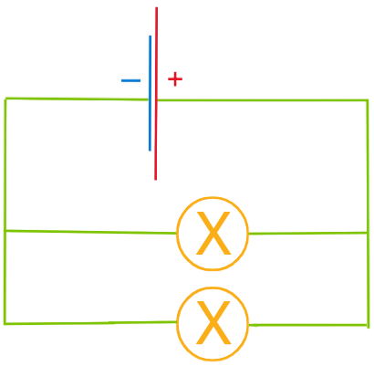

==Электризация== - это явление возникновения электрических свойств у тела. Вещество является наэлектризованным, когда оно при трении приобретало свойство притягивать легкие тела. При трении электризуются оба тела.

Эбонит - разновидность каучука, темно серый цвет, является диэлектриком.

>Одноименные заряд отталкиваются, разноименные - притягиваются

==Электроскоп== - это приборы, служащие для электризации тел.

![[14.jpg]]

Человеческое тело и металл - проводники.
Стекло, резина, эбонит, фарфор - диэлектрики.
Полупроводники - это вещества, которые не проводят электрический ток при низкой температуре, однако при её повышении становятся проводниками.

---
🏠[[Главная страница]]
[[📒 Закон Кулона]]➡️