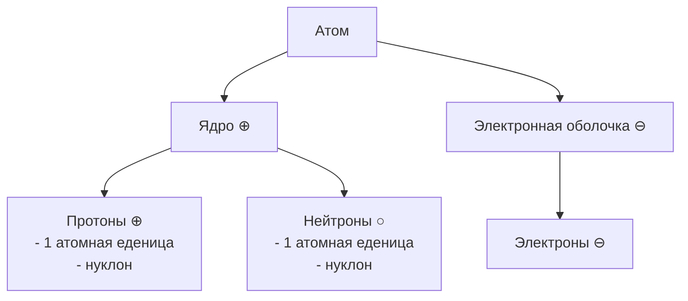

#class-8 #ilian445 #chemistry

**1911 г.** - Французкий учёный Эрнест Резерфор представил планетарную модель строения атома.

>[!NOTE] Вся масса атома сосредоточена в ядре

Порядковый номер в таблице менделеева = Заряд ядра = Число протонов = Число электронов

---
⬅️[[📒Основания. Классификация и свойства оснований β.]]
🏠[[Главная страница]]
🧪[[Химия|Вернуться к предемету]]